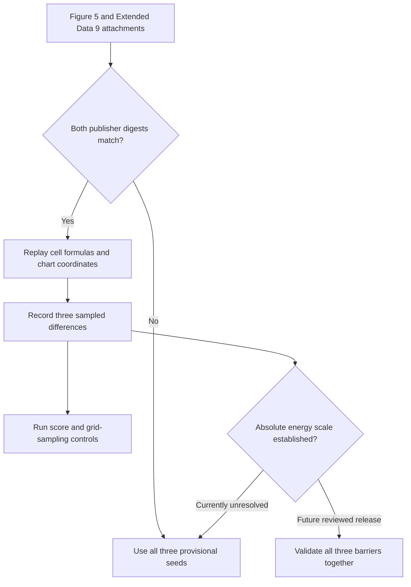

# Benchmark data flow

```mermaid
flowchart TD
    A["Figure 5 and Extended Data 9 attachments"] --> B{"Both publisher digests match?"}
    B -->|Yes| C["Replay cell formulas and chart coordinates"]
    B -->|No| F["Use all three provisional seeds"]
    C --> D["Record three sampled differences"]
    D --> G["Run score and grid-sampling controls"]
    D --> E{"Absolute energy scale established?"}
    E -->|"Currently unresolved"| F
    E -->|"Future reviewed release"| H["Validate all three barriers together"]
```

[Extraction status](../data/processed/EXTRACTION_STATUS.md) · [Control results](benchmark_validation.md) · [Checkpoints](../CHECKPOINTS.md)
